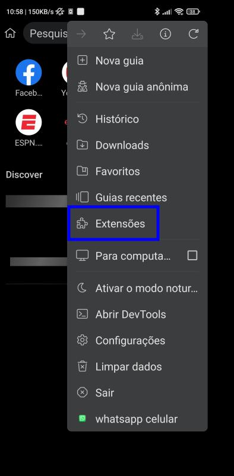
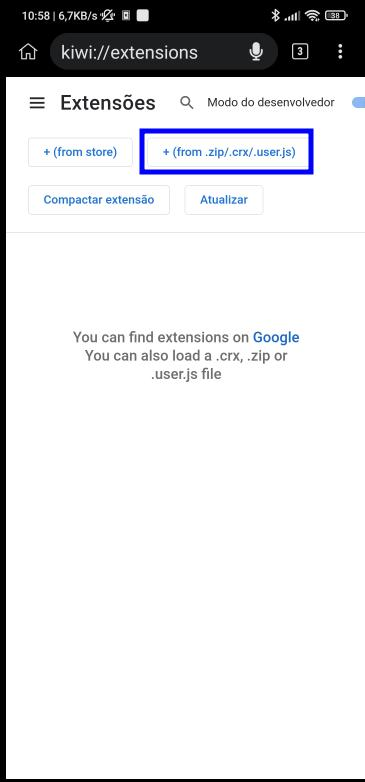
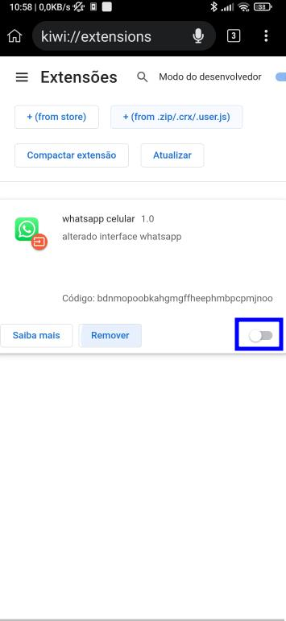
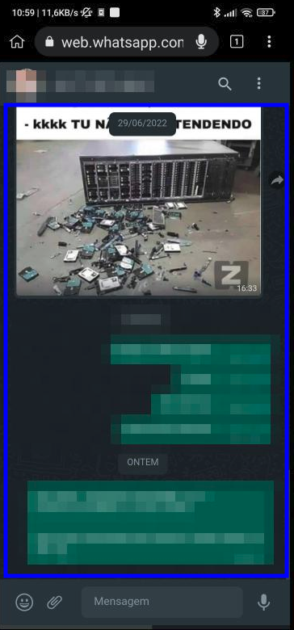

# Whatsapp Web para celular

## Processo de desenvolvimento

Eu estava a procura de uma solução para utilizar o whatsapp web em um aparelho celular mas que não fosse tão ruim de usar como é de forma padrão então comecei a pensar em como poderia alterar a interface para conseguir ficar mais agradável o uso pelo celular. Então comecei a alterar a forma de visualização, depois comecei a pensar em como fazer isso através do celular, lembrei que extensões para navegador conseguem injetar código em uma página web, então comecei a pesquisar se tinha algum para Android e encontrei um browser chamado Kiwi que ele permite instalar extensões do Chrome, pesquisando sobre como desenvolver encontrei com um [video do Rafael(Hacking na Web)](https://www.youtube.com/watch?v=aBPE-PCivu4) que eu ja acompanhava o seu trabalho pelo instagram, nesse vídeo Ele explica como criar uma extensão para o chrome e porque é um recurso tão perigoso, foi exatamente o'que eu precisava para fazer funcionar essa pequena ideia. Conheço bem básico de front-end acredito que poderia ser feito algumas melhorias pois, no navegador do celular ainda tem problemas de ajuste do tamanho da página para visualização.

## Instalação no celular

* [Baixe o navegador Kiwi](https://play.google.com/store/apps/details?id=com.kiwibrowser.browser&hl=pt_BR&gl=US)
* [Baixe o arquivo da extensão compilado](https://github.com/dowriqrosa/WhatsappWebPlugin/raw/main/chormeAPP.crx)

* Na tela do Kiwi Browser siga o passo a passo abaixo:

* Agora é so acessar o site do [whatsappWeb](https://web.whatsapp.com/).

## Como utilizar

* Ao finalizar a sincronização com o primeiro toque na ele ira ajustar o tamanho da tela para o tamanho do dispositivo.

* Para abir uma conversa basta clicar na conversa desejada

* Na tela da conversa para voltar bata clicar duas vezes em alguma parte da area de toque (marcação em azul) abaixo:

## Telas

